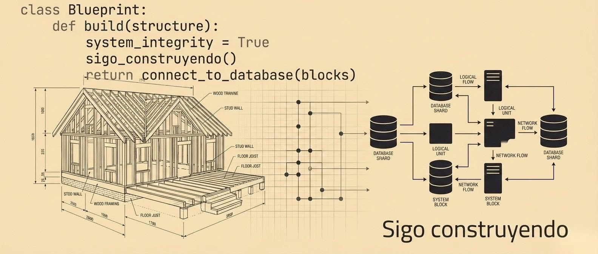

  

  <h1>Hola, soy Héctor Aguila</h1>
  
<code>> Un Soñador con Poca RAM 👨🏻‍💻</code>

  

    <strong>Estudiante de Ingeniería en Informática</strong> • Mención en Desarrollo de Software 
    Interés en Arquitectura de Soluciones & Ciencia de Datos • Puerto Montt, Chile
  

    
    
    
  

---

## Sobre Mí: Arquitectura con Propósito

### `$ whoami`

|                         |                                                                                            |
| :---------------------- | :----------------------------------------------------------------------------------------- |
| **Estado actual** | Tercer año de Ingeniería en Informática (Mención Desarrollo de Software)               |
| **Rol Objetivo**  | Desarrollador Junior / Estudiante de Ingeniería / Data Scientist.      |
| **Aprendiendo**   | Kotlin Multiplatform, Arquitecturas Agénticas (IA), Microservicios, Data Science.         |
| **Filosofía**    | **"Orden antes que velocidad"**. Marco de Construcción Responsable. |

### Certificaciones & Formación

* **Cloud & Data**: Azure Fundamentals (AZ-900), Azure Data Fundamentals (DP-900), PowerBI (Daxus), Fabric Data Engineer (Código Facilito).
* **Inteligencia Artificial**: Google AI Professional, Generative AI Professional (GAIPC), "Desarrollo con IA: de 0 a Producción" (BIG School & Brais Moure).
* **Desarrollo & Ingeniería**: Especialización en Diseño & Arquitectura de Software (U. Alberta - En curso: 1 de 4), Certificación Profesional en Aplicaciones Web (U. New Mexico), Arquitecto de Datos IBM (En curso: 1 de 11), Bootcamp Ingeniero de Datos en Fabric (12 semanas), Python Essentials 1 (Cisco).

---

## Desarrollo y Experimentación con IA

Mi enfoque se centra en el <strong>Diseño de Sistemas</strong> y el uso estratégico de la IA para optimizar el desarrollo. Me apasiona proyectar cómo interactúan los componentes de una solución antes de pasar a la ejecución. Utilizo herramientas de IA para asistir en la codificación y automatizar procesos técnicos, lo que me permite concentrarme en la solidez de la arquitectura y en <strong>construir con propósito</strong>.

* **Paper Académico**: [Simbiosis Humano-IA como Acelerador de Recuperación Funcional](https://zenodo.org/records/18845510) (Publicado en JAIGP/Zenodo).
* **Articulo en LinkedIn**: [La pantalla como espejo: externalizar el pensamiento](https://www.linkedin.com/pulse/la-pantalla-como-espejo-externalizar-el-pensamiento-cuando-aguila-3nkxf).
* **Ensayo Creativo**: Actualmente escribiendo un thriller de ciencia ficción basado en experiencias reales de interacción con IA (1M+ tokens de contexto analizados).

---

## Desarrollo de Soluciones Resilientes

Desarrollo soluciones donde la IA no es un chatbot, sino un componente de arquitectura robusto con gobernanza y contingencia.

- **Misael: Agente con Protocolos Éticos**: Implementación de automatizaciones asistidas por IA con marcos éticos y protocolos de actuación basados en impacto humano.
- **Arquitectura Resiliente (Investigación)**: Exploración de **Motores de Fallback (NL2SQL / PL/SQL)** para garantizar la continuidad operativa ante fallos de APIs externas.
- **Ingeniería de Contexto**: Implementación de RAG (Retrieval-Augmented Generation) y SDDs (System Design Documents) para la orquestación de tareas complejas.

## Ecosistema de Proyectos

### Arquitectura & IA Aplicada

**[UNB: The Unreliable Narrator Benchmark](https://github.com/HecAguilaV/Hackaton_Kaggle/tree/main/Hackaton_Kaggle)**

> **Enfoque**: Benchmark para el Hackaton de **Google DeepMind & Kaggle** ("Measuring Progress Towards AGI"). Evalúa la transición de los LLMs de "Loros Estocásticos" a **Simbiontes Críticos**, midiendo su capacidad para detectar mitomanía e inconsistencias en la interacción.

**[Machine Learning: Ecosistema Dev](https://github.com/HecAguilaV/ML_Analisis_Ecosistema_Dev)**

> **Impacto**: Sistema de alta precisión para la predicción salarial y detección de tendencias tecnológicas.

- Implementación de un pipeline MLOps robusto (Kedro, DVC, Docker) que procesa datos de 89K+ desarrolladores. Proyecta una precisión de predicción superior al 90% en modelos de regresión optimizados.

**[Voz de Cristal (IA Ética &amp; TinyML)](https://vozdecristal.vercel.app/)**

> **Enfoque**: Diseño sistémico para la detección temprana de vulneración infantil.

- **Concepto**: Dispositivo de **Protección Silente** que utiliza **TinyML** para identificar patrones de riesgo físico en el borde.
- **Estrategia**: [Dossier Estratégico (Zenodo DOI)](https://doi.org/10.5281/zenodo.18846432).
  > *Héctor Aguila. (2026). HecAguilaV/VozdeCristal-Estrategia: implementando zenodo. Zenodo.*

**[SIGA (Gestión Empresarial)](https://siga-webcomercial.vercel.app/)**

> **Estado**: Ecosistema en proceso de **Migración de Infraestructura** y Arquitectura (Monorepo/Microservicios).

- Acceso a **[WebApp (Demo)](https://siga-webapp.vercel.app/login)**. En proceso de investigación de **Arquitecturas Resilientes** (Integración de Gemini con Fallback en DB).

### Herramientas & Colaboración

**[ERTC (Estructura Relacional del Trabajo Colectivo)](https://hecaguilav.github.io/ERTC/)**

> **Enfoque**: **Arquitecto Técnico** y Desarrollador para ecosistema colaborativo (Cámara Chilena de IA - CCHIA / Roberto Salas).

- Plataforma asíncrona "Marketplace" con Serverless Functions (Vercel) y Vanilla JS. Protección de tokens y persistencia distribuida.

**[El Arca (Biblioteca Digital &amp; Búsqueda Semántica)](https://el-arca.vercel.app/)**

> **Envergadura**: Gestión de corpus documental con **1,000+ archivos PDF** cargados desde Google Drive.

- Aplicación web funcional para la interacción con una vasta biblioteca teológica. Actualmente en proceso de optimización de **etiquetado semántico y metadatos** para potenciar el pipeline RAG y perfiles de IA.

### Prototipado & Lógica Esencial

**[Lucas: Level 18 (Canvas Game)](#)**

> **Propósito**: Un regalo programado para el cumpleaños 18 de mi hijo. La tecnología como puente de conexión humana.

- Uso avanzado de Vanilla JS Modular, HTML5 Canvas y física de juego tipo platformer (Demo restringida por privacidad).

**[Aplicación Blog (Ruby on Rails)](https://github.com/HecAguilaV/Aplicacion_Blog)**
- **Capstone de la Certificación UNM**: Proyecto enfocado en arquitectura **MVC**, **ActiveRecord** y escalabilidad bajo el framework **Ruby on Rails 7**. Ingeniería de backend aplicada a la gestión de contenidos.

---

## Stack Tecnológico

| Arquitectura & Infraestructura                                                                                  | Agilidad & IA Generativa                                                                                                     |
| :-------------------------------------------------------------------------------------------------------------- | :--------------------------------------------------------------------------------------------------------------------------- |
|  |                             |
|                |          |
|    |                             |
|                | -8E75B2?style=flat-square&logo=google&logoColor=white) |

---

## Marco de Construcción Responsable

Mi toma de decisiones sigue un protocolo estructural de <strong>6 capas de prioridad</strong> que garantiza soluciones éticas y humanas:

1. **Ética**: Verdad y responsabilidad antes que funcionalidad.
2. **Humana**: ¿Qué transformación positiva genera en el usuario? (**Capa Suprema**).
3. **Cognitiva**: Diseño pedagógico que fomenta la comprensión real.
4. **Estructural**: Arquitectura sólida antes que maquillaje (UX > UI).
5. **Técnica**: Código limpio, seguro, mantenible y escalable.
6. **Proyección**: Visión de sostenibilidad a largo plazo.

> **"Orden antes que velocidad. Arquitectura antes que maquillaje. Construir con propósito."**
> Diseño la arquitectura y la lógica estructural bajo mi Marco Personal de Trabajo; la IA actúa como mi brazo ejecutor y herramienta de orden. Mi valor reside en la **Validación Crítica**, la **Orquestación de Sistemas** y la capacidad de guiar a las máquinas para ejecutar soluciones diseñadas con un sentido técnico y humano.

---

  
<code>> Un Soñador con Poca RAM 👨🏻‍💻</code>

  
<em>"Caminante, no hay camino, se hace camino al andar."</em>

